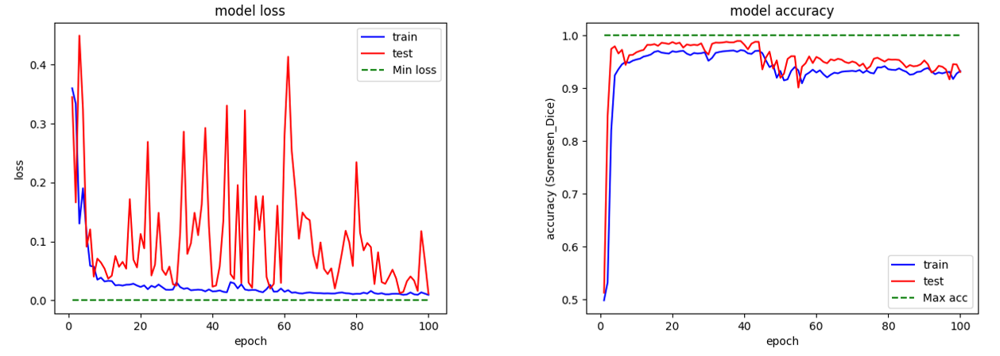

# Cassandre Project
*Made by : [Matthieu Bachelot](https://github.com/bachelow)*

# What is Project Cassandre ?

* Master thesis project
* Use deep learning methods on MRI volumes
* Detect tumors on MRI slice using semantic segmentation

# Methodology

* Test several architectures
* Test several data modeling / data generation methods
* Select the best

# Architectures 

* Auto Encoder / PSPnet / UNet / SegNet
* Kepp their architectures intact
* Test metric / loss / optimizers

# Data generation techniques
## Ressources constraints

# Data modeling methods
## Ground Truth representation

# Final results
## Focus on two networks -> reduce test time

* Statistical study on test data
* PSPNet was the best overall
* Training using Mini batch generation / One hot Vector representation / Data Augmentation

# Limits 

* Lot of result variation between patients
* Heterogeneous dataset
* time limits